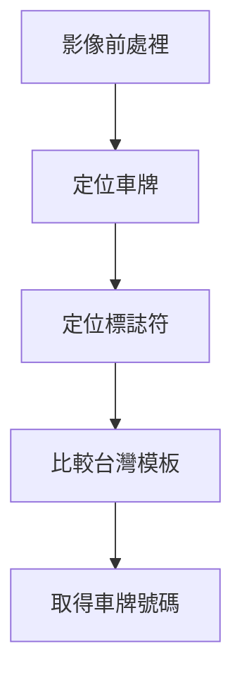

__# Opencv-Python-車牌辨識__

# 利用 OpenCV 形態學處裡完成台灣車牌辨識
* 使用到的演算法包含:
1. 模糊去躁
2. 侵蝕、膨脹
3. CCLabeling Algorithm
4. 直方圖均衡化
5. 邊緣檢測
6. Top Hat、Black Hat 演算法

# 辨識車牌流程

  ### 影像前處裡
  > 1. Resize影像
  > 2. 高斯模糊降躁 
  > 3. 值方均值化 -> 去除光害
  > 4. 將影像轉成二值圖

  ### 定位車牌
  > 1. 利用CClabeling 去除二值圖中的雜點
  > 2. 利用侵蝕膨脹修補二值圖
  > 3. Sobel、Canny 邊緣檢測後取得label面積比例
  > 4. 利用台灣車牌比例比較label比例取得車牌座標
  > 5. 利用座標將車牌從原圖剪下

  ### 定位標誌符 
  > 1. Resize車牌（200*550）
  > 2. 利用Black-Hat演算法加強車牌字體
  > 3. 利用輪廓檢測定位字符
  > 4. 將字符從原圖剪下

  ### 比較台灣模板 
  > 1. 將台灣車牌文字模板的每個字母和數字切下
  > 2. 將模板和要檢測的字符進行二值化
  > 3. 利用pixels數量當作相似性指標
  > 4. 以誤差1%以內當作符合
  
  ### 取得車牌號碼 
  > 1. 將所有要檢測字符比較完，並輸出車牌計算結果
  
