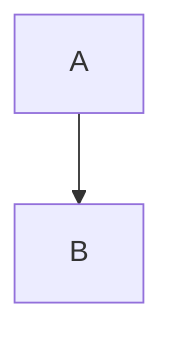

__# Opencv-Python-車牌辨識__

# 利用 OpenCV 形態學處裡完成台灣車牌辨識順便熟悉OpenCV函式的使用方式
  1. 模糊去躁
  2. 侵蝕、膨脹
  3. CCLabeling Algorithm
  4. 直方圖均衡化
  5. 邊緣檢測
  6. Top Hat、Black Hat 演算法

# 辨識車牌流程

```mermaid
flowchart TD;
  A-->B;
```
